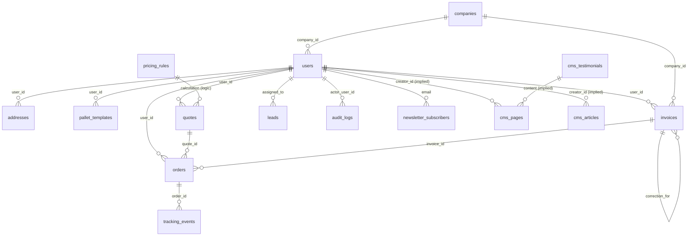

# Schemat Bazy Danych (ERD)

## Diagram relacji

## Tabele i rola biznesowa
- `companies`: dane firmy B2B, limity kredytowe.
- `users`: konta, role, status weryfikacji.
- `addresses`: książka adresowa nadawcy/odbiorcy.
- `pallet_templates`: szablony ladunkow.
- `carrier_services`: oferta i limity przewoznikow.
- `quotes`: wynik kalkulacji i parametry wejscia.
- `orders`: zamowienia z danymi adresowymi i cenowymi.
- `tracking_events`: os czasu statusow przesylki.
- `invoices`: dane rozliczeniowe/faktury.
- `leads`: zapytania handlowe i niestandardowe.
- `cms_pages`, `cms_articles`: tresci CMS i blog.
- `audit_logs`: historia operacji administracyjnych (kto/co/kiedy).

## Rekomendowane indeksy (do wdrozenia)
- `orders(status, created_at)`
- `orders(user_id, created_at)`
- `orders(carrier_tracking_number)`
- `tracking_events(order_id, occurred_at)`
- `leads(status, created_at)`
- `quotes(created_at)`
