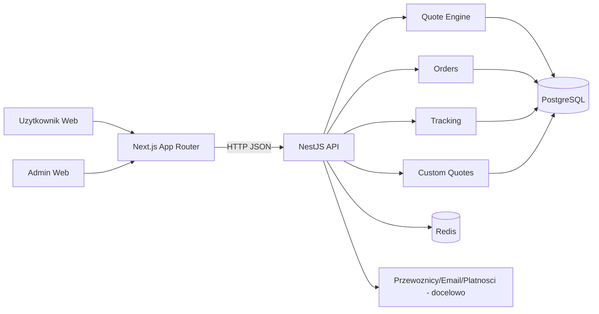

# Mapowanie Systemu (Admin-First)

## Stos technologiczny
- Frontend: Next.js 16, React 18, TypeScript, Tailwind 4, Zustand, React Hook Form, Zod.
- Backend: NestJS 11, TypeScript, class-validator, Drizzle ORM.
- Baza: PostgreSQL 15.
- Cache/queue-ready: Redis 7 (docker compose).

## Moduly backend
- `auth`
- `quote-engine`
- `orders`
- `tracking`
- `custom-quotes`
- `carriers`
- `cms`
- `leads`
- `users`
- `admin`
- `analytics`
- `documents`
- `invoices`
- `health`
- `newsletter`
- `address-book`
- `currencies`
- `payments`
- `notifications`
- `websockets`
- `api-key`
- `integrations`
- `erp-adapters`
- `redis`

## Widoki panelu admin
- `/admin`
- `/admin/zamowienia`
- `/admin/uzytkownicy`
- `/admin/leady`
- `/admin/cms`
- `/admin/wyglad`
- `/admin/cennik`
- `/admin/finanse`
- `/admin/logi-systemowe`
- `/admin/ustawienia`

### Zakres sterowania frontendem z admina
- `global-settings`: navbar, stopka, baner, podstawowe dane brandu.
- `home` (CMS): hero, wsparcie, CTA, testimoniale + URL grafik (`heroVisualImage`, `supportVisualImage`, `ctaVisualImage`, `avatarImage`).
- `home` (CMS media library): upload/lista/usuwanie plikow (`/cms/media`, `/cms/media/upload`) z mapowaniem do pol homepage.

### CMS API (admin-facing)
- `GET /cms/pages`, `GET /cms/pages/:slug`
- `PUT /cms/pages/:slug` (upsert: update or create)
- `GET /cms/articles`
- `GET /cms/media` (admin)
- `POST /cms/media/upload` (admin, multipart/form-data)
- `DELETE /cms/media` (admin)

## Priorytety funkcji (P0/P1/P2)
- `P0`:
  - auth + RBAC admin/user
  - quotes/orders/tracking correctness
  - walidacja wejscia i integralnosc danych
- `P1`:
  - CRUD admin (orders/leads/users/cms)
  - observability i alerty
  - testy e2e admin
- `P2`:
  - eksporty, bulk actions, KPI dashboard
  - feature flags, audit UX rozszerzony

## Diagram przeplywu danych

