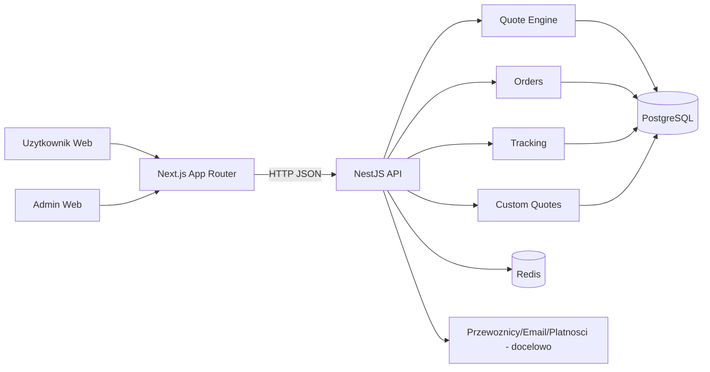

# Mapowanie Systemu (Admin-First)

## Stos technologiczny
- Frontend: Next.js 16, React 19, TypeScript, Tailwind 4, Zustand, React Hook Form, Zod.
- Backend: NestJS 11, TypeScript, class-validator, Drizzle ORM.
- Baza: PostgreSQL 15.
- Cache/queue-ready: Redis 7 (docker compose).

## Moduly backend
- `auth`
- `quote-engine`
- `orders`
- `tracking`
- `custom-quotes`
- `carriers`

## Widoki panelu admin
- `/admin`
- `/admin/zamowienia`
- `/admin/uzytkownicy`
- `/admin/leady`
- `/admin/cms`
- `/admin/ustawienia`

## Priorytety funkcji (P0/P1/P2)
- `P0`:
  - auth + RBAC admin/user
  - quotes/orders/tracking correctness
  - walidacja wejscia i integralnosc danych
- `P1`:
  - CRUD admin (orders/leads/users/cms)
  - observability i alerty
  - testy e2e admin
- `P2`:
  - eksporty, bulk actions, KPI dashboard
  - feature flags, audit UX rozszerzony

## Diagram przeplywu danych

